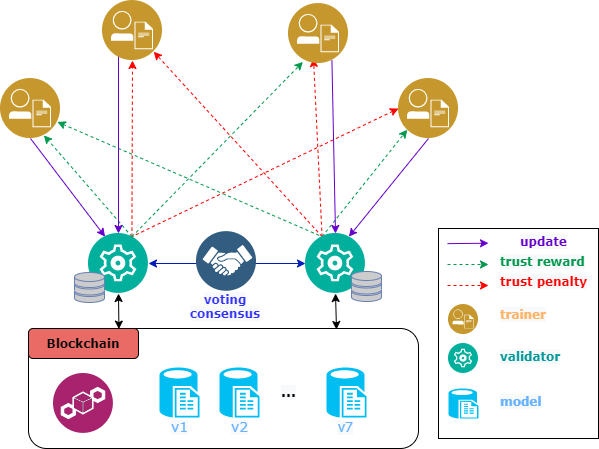
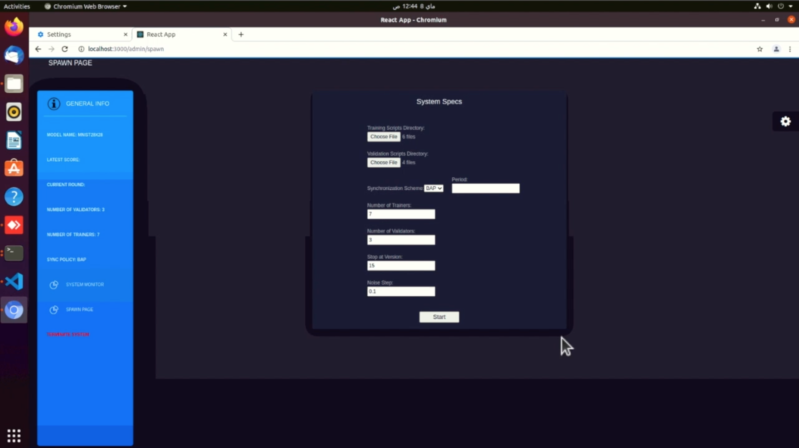
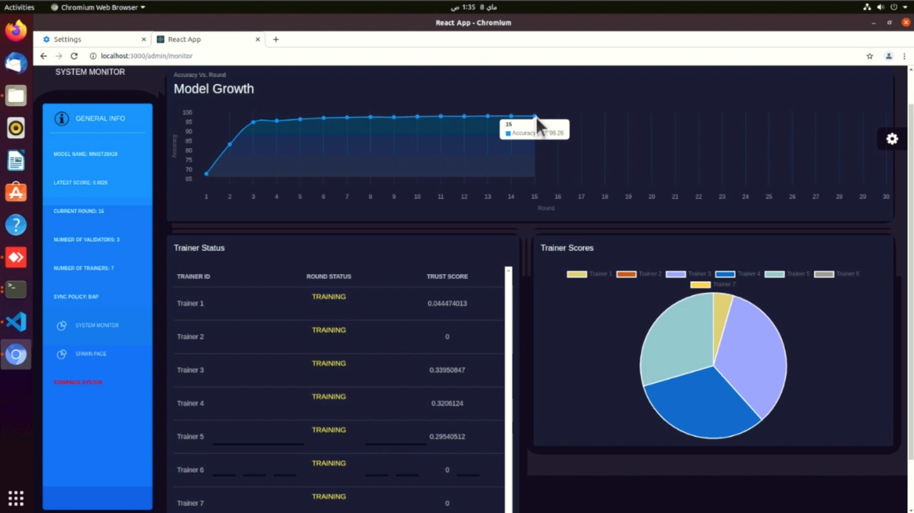

# FLoBC: A Decentralized Blockchain-Based Federated Learning Framework
This repository is an implementation of [FLoBC: A Decentralized Blockchain-Based Federated Learning Framework](https://ieeexplore.ieee.org/stamp/stamp.jsp?arnumber=9922258&casa_token=RrTQKm66HhoAAAAA:9O3iH1H4_qiB4W7fgNK38G_lU7cn4bOfm-oiYVuHtrApo2QZ_YdtWFLJ4RqMUaNRIyPO_jy-_a1aAQ&tag=1).
```
@inproceedings{ghanem2022flobc,
  title={FLoBC: A Decentralized Blockchain-Based Federated Learning Framework},
  author={Ghanem, Mohamed and Dawoud, Fadi and Gamal, Habiba and Soliman, Eslam and El-Batt, Tamer},
  booktitle={2022 Fourth International Conference on Blockchain Computing and Applications (BCCA)},
  pages={85--92},
  year={2022},
  organization={IEEE}
}
```

This project supports the training of stochastic gradient descent models over blockchain.
Training and validation is performed on the user's local data. Nodes share insights or gradients rather than data.
The system utilizes a reward/punishment policy to incentivize legitimate training, and to punish and hinder malicious trainers. <br><br>
<br><br>
As shown in the figure, trainers nodes perform local training, then share their updates with the validators that evaluate their updates and carry out the consensus process to update the global model on the blockchain. Subsequently, trainers are given a trust reward or pentaly, and a new model is added to the blockchain. <br><br>
For more details about the system, check [the slides](https://docs.google.com/presentation/d/1koIePQY4zOhS8jltEeFZ27Q99Ua_KlZIDUb6Zcn_VCI/edit?usp=sharing) and [this video](https://drive.google.com/file/d/1e6TVJ5_nI7mPKt9JTVXy2bMrMx7xXkqG/view?usp=sharing). 

## Prerequisites
- git clone https://github.com/Oschart/FLoBC.git
- npm 
- node https://nodejs.org/en/download/
- babel 
``` shell
$ npm install -g babel-cli
```

## To Run the Tool

### Using GUI
##### Install the prerequisites
``` shell
$ npm install express
$ npm install 
````

##### To run the web service
``` shell
$ cd frontend/src/components
$ node service.js
$ cd ../..
````

``` shell
$ cd frontend
$ npm start
````

###### Initialization Form
To configure the system


###### Progress Monitoring


###### Demo Video
<a href="https://drive.google.com/file/d/1indstlHqPbDn9WctNczFZVVRBCU-5qbf/view?usp=sharing"></a>

### Using Scripts
Using the [spawn script](./scripts/spawn/spawn.sh), you can run the system with certain number of trainers, validators, synchronization scheme and training period.
For instructions on how to run the spawn script, [check](./scripts/spawn/README.md)

### Manually

##### To build the rust code and/or the validating node
``` shell
$ cd backend
$ sh build_finalize.sh -n <number of validating nodes> -b -c -j 
$ cd ..
````
- -b is used to build rust
- -c is used to clear the blockchain
- -j is used to build the node.js validator

##### To run the validating node
``` shell
$ cd backend
$ sh run_node <node number> <sync scheme> <scoring flag> <model directory name>
$ cd ..
````
##### To build the lightclient 
``` shell
$ cd lightclient
$ npm install
$ npm start -- <validator port number> <dataset past> <trainer noise> <model directory name> 
```

## To use the provided models, you need:
- python >= 3
- tensorflow
- keras
- numpy
- pandas

## To use the provided MNIST 28x28 models, download MNIST data
https://www.kaggle.com/oddrationale/mnist-in-csv

## To use the provided MNIST 20x20 models:
resize the downloaded data using [this script](./dataset&#32;utils/MNIST_resize.py), or download it from [here](https://drive.google.com/drive/folders/1tOyb5J4kDwkOA8ML0Ub-gmj-b44LvMzU?usp=sharing)

- N.B. Place training data in ./lightclient/models/MODEL_NAME/
- N.B. Place test data in ./backend/tx_validator/src/models/MODEL_NAME/data.csv

## Authors
* **Mohamed Ghanem** [Oschart](https://github.com/Oschart)
* **Fadi Adel** [theRadFad](https://github.com/theRadFad)
* **Habiba Gamal** [habibagamal](https://github.com/habibagamal)
* **Eslam Soliman** [Eslam-Soliman](https://github.com/Eslam-Soliman)
* Dr. Hossam Sharara
* Dr. Tamer ElBatt
